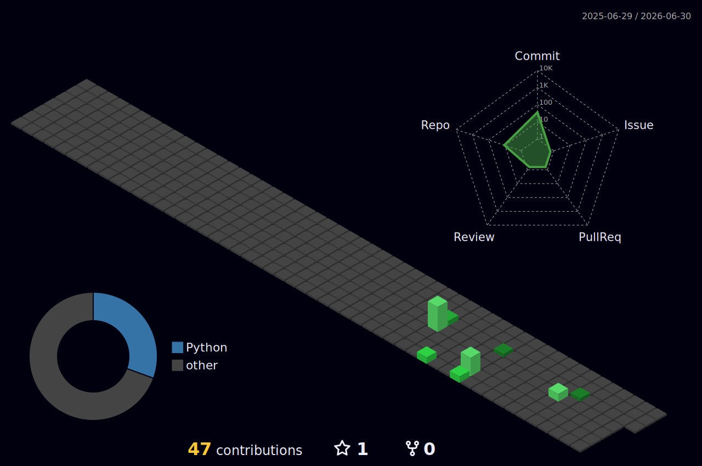

<!-- ARCADE HEADER -->

<!-- TYPING ANIMATION (RETRO FONT) -->

 

### ⚔️ PLAYER STATS
**Class:** Developer | **Status:** Online | **Base:** Earth

---

### 🎒 INVENTORY (SKILL TREE)

<!-- Note: If you use game engines, uncomment the badges below! -->
<!--  -->
<!--  -->

 

### 🗺️ WORLD MAP (CONTRIBUTIONS)

 

### 🐍 MINIGAME: COMMITS
<picture>
  <source media="(prefers-color-scheme: dark)" srcset="https://raw.githubusercontent.com/AJ-GIT-HUB900/AJ-GIT-HUB900/output/github-contribution-grid-snake-dark.svg">
  <source media="(prefers-color-scheme: light)" srcset="https://raw.githubusercontent.com/AJ-GIT-HUB900/AJ-GIT-HUB900/output/github-contribution-grid-snake.svg">
  
</picture>

